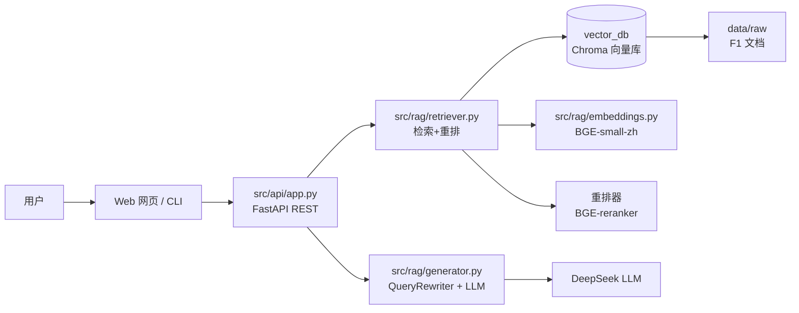

# 🏎️ AiAgent — F1 知识库问答 + Multi-Agent

一个完整可运行的 **RAG（检索增强生成）知识库问答 + Multi-Agent** 项目，演示从数据构建、多路检索到多智能体协作的完整工程化实践。

知识库主题为 **F1（世界一级方程式锦标赛）**，覆盖 2026 新规术语 / FIA 赛事规则 / 历史与历届冠军 / 赛程演进 / 经典夺冠决战，展示「中文查询 → 英文检索 → 语义检索 → 重排 → 生成 → 来源标注」的完整 RAG 链路。

应跨语言检索的需要，本项目默认以**中文提问、英文检索**（QueryRewriter 中英改写），并用**重排序（BGE-Reranker）**将最相关的片段提到最前，最后在回答中**标注来源文档**，可追溯、可验证。

---

## ✨ 功能亮点

| 模块 | 说明 |
|------|------|
| 🔍 RAG 问答 | 语义检索 + 重排 + 溯源，回答带来源标注 |
| 🌐 中英改写 | 中文问题先改写为英文检索词，跨语言召回更准 |
| 🤖 多 Agent | knowledge / calculator / time 工具，可编排单 Agent 或多 Agent 协同 |
| 🔒 安全加固 | 计算器用 `ast` 白名单代替原生 `eval()`，杜绝任意代码执行 |
| 🧩 工程化 | 分层包结构、集中配置、单例缓存、异常处理、日志、单元测试 |
| 🖥️ Web / CLI | FastAPI 网页问答 + `cli_agent.py` 命令行双入口 |

---

## 🏗️ 架构总览



- **检索召回**：输入问题 → `QueryRewriter` 改写为英文检索词 → 向量库召回 Top-K 候选 → `BGE-reranker` 精排取 Top-N → 拼入上下文。
- **生成回答**：`AnswerGenerator` 基于上下文 + 问题调用 `deepseek-chat`，未检索到相关内容时明确告知，不硬编。
- **来源标注**：召回片段保留 `source`（文档名），上下文与回答都带 `[来源: 文档.txt]`，可追溯。

---

## 📁 目录结构

```
aiAgent/
├── config.py              # 集中配置（LLM / embedding / 检索 / 切分 / 路径 / 输入限制）
├── .env.example           # 配置模板（复制为 .env 并填 Key）
├── src/
│   ├── rag/
│   │   ├── embeddings.py  # embedding 单例（懒加载）
│   │   ├── retriever.py   # 检索 + 重排 + 上下文携带来源
│   │   ├── generator.py   # LLM 客户端（超时/重试）+ QueryRewriter + AnswerGenerator
│   │   └── kb.py          # 参数化知识库构建
│   ├── agents/
│   │   ├── tools.py       # 工具：safe_calc（安全计算）/ time / 知识库检索
│   │   └── orchestrator.py# 单 / 多 Agent 编排
│   ├── api/app.py         # FastAPI REST 服务（POST /query）
│   ├── cli_agent.py       # 命令行入口（--mode rag/agent/multi）
│   └── *（保留的演示脚本）
├── data/
│   ├── raw/               # F1 原始文档（UTF-8，带来源标注）
│   └── cleaned/           # 清洗后文档目录
├── vector_db/vectorstore  # Chroma 向量库（由 kb.py 构建）
├── static/index.html      # F1 风格网页前端
├── tests/                 # 离线单元测试（不依赖 Key / 向量库 / 网络）
└── requirements.txt
```

> 扩展点集中：Agent 编排在 `src/agents/orchestrator.py`，检索策略在 `src/rag/retriever.py`，服务层在 `src/api`，各层可独立增强而不互相耦合。

---

## 🚀 快速开始

### 1. 环境准备

```bash
python -m venv venv
venv\Scripts\activate            # Windows
pip install -r requirements.txt
```

### 2. 配置密钥

```bash
copy .env.example .env           # Windows
# 编辑 .env，填入 DEEPSEEK_API_KEY
```

### 3. 构建 F1 知识库（首次或换库时）

```bash
python -m src.rag.kb --data data/raw
# 参数：--chunk-size / --chunk-overlap 可调切分；--no-rebuild 增量追加
```

### 4. 启动 Web 服务

```bash
uvicorn src.api.app:app --reload
# 浏览器打开 http://127.0.0.1:8000
```

### 5. 命令行问答

```bash
python -m src.cli_agent --mode rag   --q "什么是 Active Aero？"
python -m src.cli_agent --mode agent --q "2026 引擎有哪些变化？"
python -m src.cli_agent --mode multi --q "2024 年总共有几站？"
```

### 6. 跑单元测试

```bash
python -m pytest tests/ -v
```

---

## 🧪 测试

- `tests/test_tools.py`：`safe_calc` 安全计算（含非法输入拒绝 / 无 eval 源码核查）
- `tests/test_config.py`：配置默认值 / 路径存在性 / `.env.example` 存在

> 单元测试离线可跑（不依赖 API Key、向量库、网络）。

---

## ⚙️ 主要配置（.env）

| 变量 | 默认 | 说明 |
|------|------|------|
| `DEEPSEEK_API_KEY` | - | DeepSeek Key（必填） |
| `LLM_MODEL` | `deepseek-chat` | 生成模型 |
| `EMBEDDING_MODEL` | `BAAI/bge-small-zh-v1.5` | embedding 模型 |
| `RERANKER_MODEL` | `BAAI/bge-reranker-base` | 重排模型 |
| `RETRIEVE_K` / `RETRIEVE_TOP` | `10` / `5` | 召回候选 / 精排取前 N |
| `CHUNK_SIZE` / `CHUNK_OVERLAP` | `500` / `50` | 文档切分 |

---

## 📚 知识库来源

| 文件 | 内容 | 来源 |
|------|------|------|
| `F1_2026_Regulations_Terminology.txt` | 2026 新规术语（Active Aero / Overtake Mode / MGU-H 等） | F1 官网 |
| `FIA_2026_Sporting_Regulations.txt` | 2026 FIA 赛事规则选编 | FIA 官方 |
| `F1_World_Championship_Overview.txt` | 世界一级方程式锦标赛历史与历届冠军 | 百科 |
| `F1_Calendar_History.txt` | 赛程与年份演进 | 百科 |
| `F1_Classic_Title_Deciders.txt` | 五场经典夺冠决战 | F1 COSMOS |

---

## 📌 说明

- 所有文档与回答仅用于个人学习与演示。
- `.env` 已加入 `.gitignore`，请勿把 API Key 提交到 GitHub；如项目仓库历史中曾提交过 Key，建议轮换。